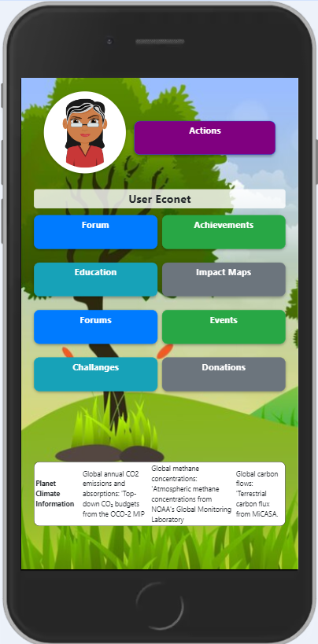
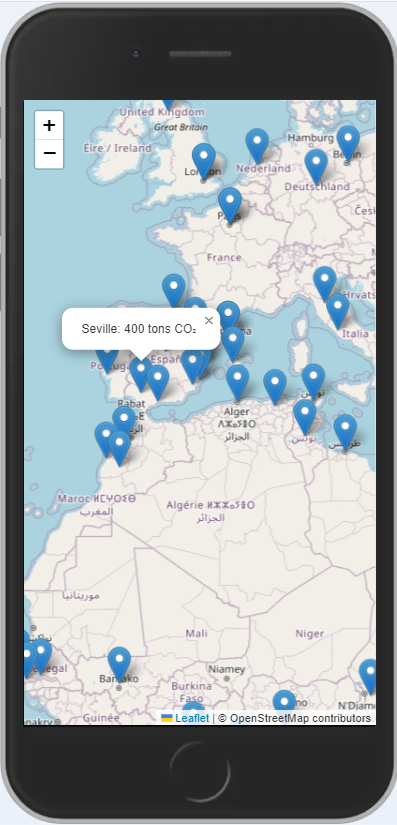

**<h1>🚀 The 2024 NASA Space Apps Challenge 🛰️</h1>**

**Team:** Changing voices

**Members:** Lorena del Carmen Requena Ponce, [Osthailyd Bautista Areiza](https://github.com/Bautistao2), Carmela García Díaz, Arun Cardenas Saenz, Alexander Tarasov, Lucía Gómez Mancebo.

**Challange:** Tell Us a Climate Story!

**Description:** Our project, EcoNect, is based on raising awareness about the impact of greenhouse gases on our planet. This will be done through an application. When opened, the app will display a 3-minute video that tells the story of our planet. It shows how the Earth has been deteriorating and, as a last hope, the Earth asks for help from a little girl.
This girl represents hope for change and shows that we still have time to save the planet. As a solution, EcoNet is presented as a social network where you can discover ways to help the environment. It aims to promote sustainable development and make it accessible to all audiences.

**<h2>VIDEO:</h2>**
[Watch the video](https://www.canva.com/design/DAGSsUE3ksA/MzQaJ9CDwACEM-q_lEgWHg/watch?utm_content=DAGSsUE3ksA&amp;utm_campaign=share_your_design&amp;utm_medium=link&amp;utm_source=shareyourdesignpanel)

**<h2>Application Design:</h2>**
[Watch the design](design/mobile_design.pdf)

**<h2>Application Screenshots:</h2>**

**<h2>How to launch the APP:</h2>**
1. mvn clean install
2. cd target
3. java -jar econet-0.0.1-SNAPSHOT.jar
4. Go to - http://localhost:8080

**<h2>DATA USED IN THE APP:</h2>**
<h3>1. Global Annual CO2 Emissions and Removals: "OCO-2 MIP Top-down CO₂ Budgets"</h3>
   link: https://earth.gov/ghgcenter/data-catalog/oco2-mip-co2budget-yeargrid-v1  
   Temporal Extent: 2015 – 2020  
   Temporal Resolution: Annual  
   Spatial Extent: Global   
   Spatial Resolution: 1° x 1°  
   Data Units: Grams of carbon dioxide per square meter per year (g CO₂/m²/yr)  
   Data Type: Research  
   Data Latency: N/A  

<h3>2. Global Methane Emissions: "TM5-4DVar Isotopic CH₄ Inverse Fluxes"</h3>
   link: https://earth.gov/ghgcenter/data-catalog/tm54dvar-ch4flux-monthgrid-v1  
   Temporal Extent: 1976 - 2023, varies by station  
   Temporal Resolution: The GHG Center provides only daily and monthly means for continuous measurements; temporal resolution varies by station for non-continuous measurements, (can be daily up to weekly)  
   Spatial Extent: Global  
   Spatial Resolution: Point location samples  
   Data Units: Parts CH₄ per billion (ppb)  
   Data Type: Operational  
   Data Latency: Updated annually  
<h3>3. Global Carbon Fluxes: "MiCASA Land Carbon Flux"</h3>
   link: https://earth.gov/ghgcenter/data-catalog/micasa-carbonflux-grid-v1  
   Temporal Extent: January 1, 2001 - December 31, 2023  
   Temporal Resolution: Daily and Monthly Averages  
   Spatial Extent: Global  
   Spatial Resolution: 0.1° x 0.1°  
   Data Units: Grams of Carbon per square meter per day (g Carbon/m²/day)  
   Data Type: Research  
   Data Latency: Less than a year, typically 6 months  

